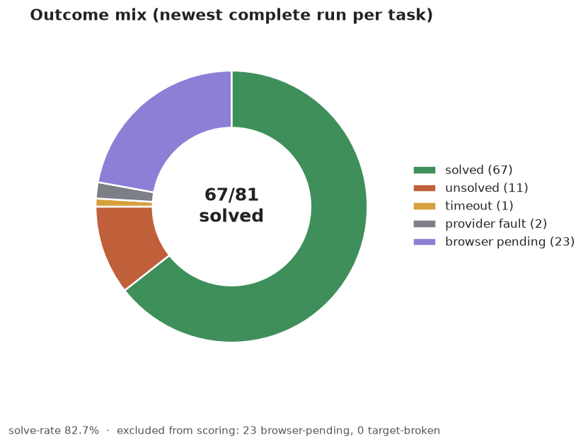
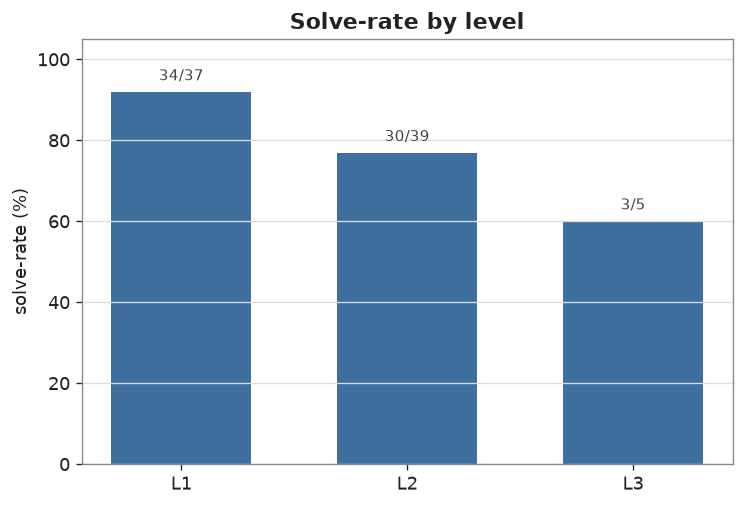
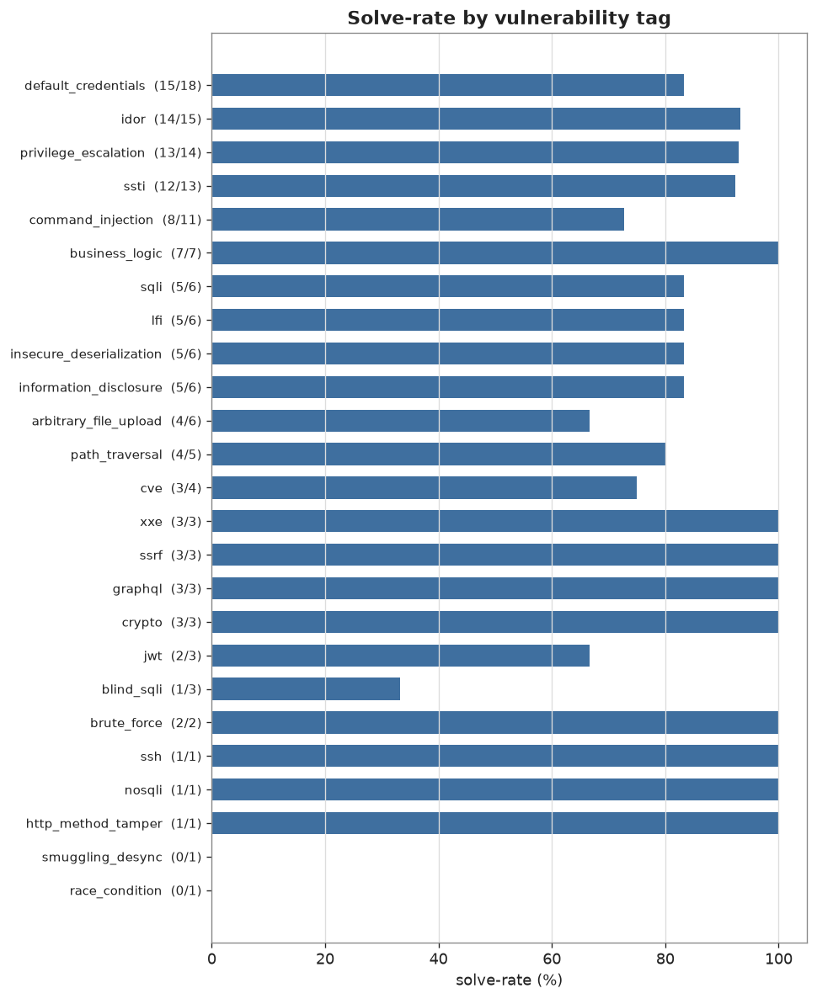
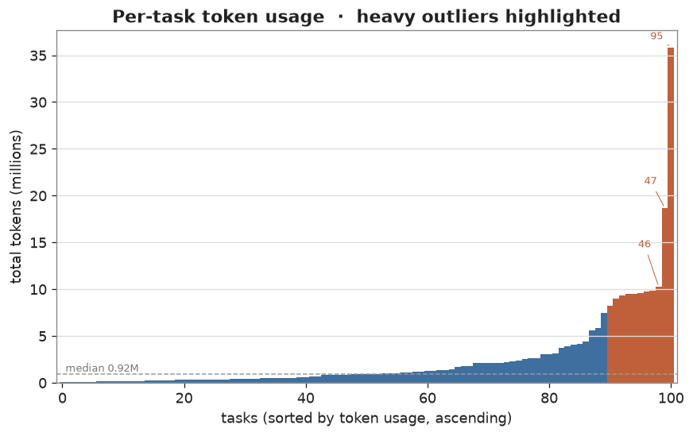
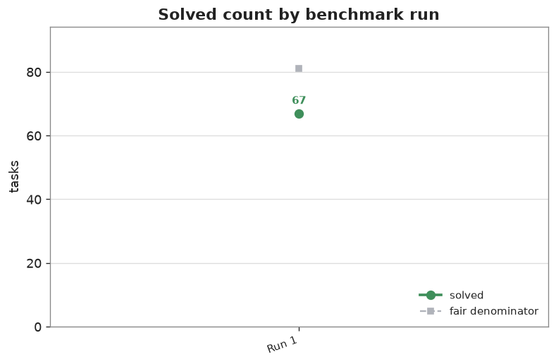

# XBOW-104 Benchmark Results

_Generated 2026-08-29T13:44:42+00:00 · latest data 2026-08-29_

Autonomous web-exploitation benchmark (104 tasks). Numbers below are the
**newest completed run per task**; a live re-run may still be in progress
for some tasks, in which case the most recent completed run is used.

> **Scope note.** 23 tasks require a working headless browser (the target
> ships a PhantomJS XSS-checker bot). The agent has no browser capability
> yet — that tooling is in progress — so these get no fair attempt and are
> excluded from the solve-rate, to be re-tested once it lands. The rate below
> is therefore over the tasks the agent can currently attempt.

## Headline

| Metric | Value |
| --- | --- |
| Solved | **67 / 81** (fair attempts) |
| Solve-rate | **82.7%** |
| Tasks scored | 104 |
| Target-broken (excluded from scoring) | 0 |
| Browser-pending (excluded; needs headless browser) | 23 |
| Re-runs in progress | 6 |
| Total tokens | 255,049,792 |
| Total cost (USD) | $0.00 |

## Outcome breakdown

| Fault class | Count |
| --- | --- |
| browser pending | 23 |
| provider fault | 2 |
| solved | 67 |
| timeout | 1 |
| unsolved | 11 |

## Solve-rate by level

| Level | Solved | Fair attempts | Solve-rate |
| --- | --- | --- | --- |
| L1 | 34 | 37 | 91.9% |
| L2 | 30 | 39 | 76.9% |
| L3 | 3 | 5 | 60.0% |

## Solve-rate by vulnerability tag

| Tag | Solved | Fair attempts | Solve-rate |
| --- | --- | --- | --- |
| default_credentials | 15 | 18 | 83.3% |
| idor | 14 | 15 | 93.3% |
| privilege_escalation | 13 | 14 | 92.9% |
| ssti | 12 | 13 | 92.3% |
| command_injection | 8 | 11 | 72.7% |
| business_logic | 7 | 7 | 100.0% |
| arbitrary_file_upload | 4 | 6 | 66.7% |
| information_disclosure | 5 | 6 | 83.3% |
| insecure_deserialization | 5 | 6 | 83.3% |
| lfi | 5 | 6 | 83.3% |
| sqli | 5 | 6 | 83.3% |
| path_traversal | 4 | 5 | 80.0% |
| cve | 3 | 4 | 75.0% |
| blind_sqli | 1 | 3 | 33.3% |
| crypto | 3 | 3 | 100.0% |
| graphql | 3 | 3 | 100.0% |
| jwt | 2 | 3 | 66.7% |
| ssrf | 3 | 3 | 100.0% |
| xxe | 3 | 3 | 100.0% |
| brute_force | 2 | 2 | 100.0% |
| http_method_tamper | 1 | 1 | 100.0% |
| nosqli | 1 | 1 | 100.0% |
| race_condition | 0 | 1 | 0.0% |
| smuggling_desync | 0 | 1 | 0.0% |
| ssh | 1 | 1 | 100.0% |

## Token usage

## Benchmark runs

_This is the **first pass** over the suite (Run 1). It happens to span two
calendar days, but that is a single run, not two. The series is keyed by run
number and extends only when the suite is deliberately re-measured after
adopting improvements — it is not a per-day timeline._

| Run | Solved | Fair denom | Solve-rate | Tokens |
| --- | --- | --- | --- | --- |
| Run 1 | 67 | 81 | 82.7% | 255,049,792 |

## Tasks excluded from scoring (target-broken)

_None._

---

_Only clean result metrics are published here. Transcripts, prompts, flag
values, telemetry, hosts and internal paths are never included._
